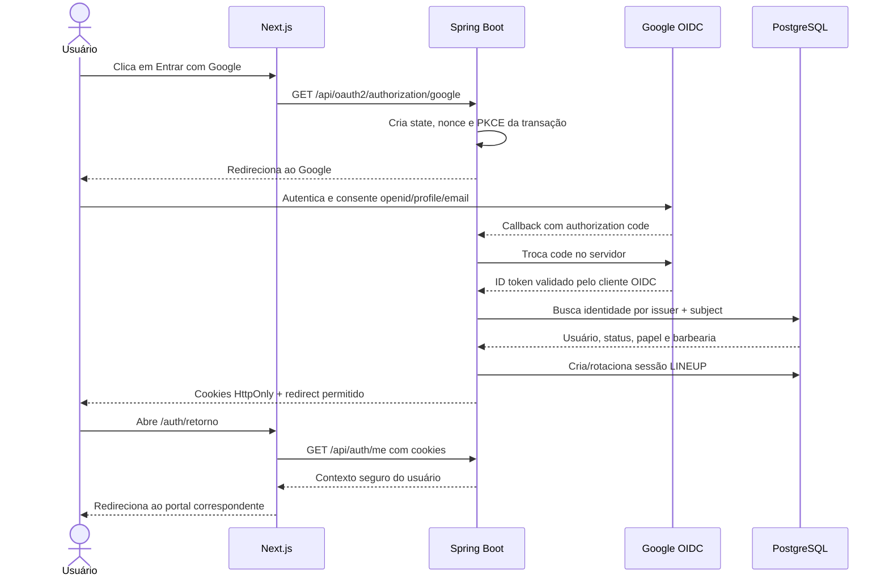

# Plano de implementação — Entrar com Google (OIDC)

**Status:** proposta para execução incremental

**Data:** 03/09/2026

**Escopo:** autenticação de usuários com Google, preservando e-mail/senha

**Fora deste escopo:** sincronização com Google Calendar e acesso a outras APIs Google

## 1. Resultado esperado

Ao final, uma pessoa poderá vincular sua conta LINEUP a uma identidade Google e, nos acessos seguintes, entrar pelo botão Google. O Google comprova a identidade; o LINEUP continua sendo a única autoridade sobre usuário, status, papel e barbearia.

O navegador não receberá tokens em URL, `localStorage` ou JavaScript. Depois do callback do Google, o backend criará uma sessão própria do LINEUP em cookies seguros e redirecionará para o frontend. Login com e-mail e senha continuará funcionando durante a implantação.

Para a primeira entrega, o login Google será habilitado apenas para contas LINEUP existentes que tenham feito um vínculo explícito. Cadastro automático por Google ficará para uma evolução separada, pois ainda não há uma regra completa para transformar um novo usuário em cliente, barbeiro ou membro de uma barbearia.

## 2. OAuth ou OIDC?

“Entrar com Google” é autenticação. Portanto, o protocolo correto é **OpenID Connect (OIDC)**, construído sobre OAuth 2.0. O fluxo será Authorization Code, executado pelo backend.

Google Calendar é outro caso: nele o LINEUP pede autorização para operar uma agenda e pode precisar guardar um refresh token do Google. As duas integrações não compartilharão tokens, escopos, tabelas nem telas de consentimento.

## 3. Diagnóstico do sistema atual

| Área | Situação atual | Impacto no plano |
|---|---|---|
| Backend | Spring Security valida JWT próprio e `POST /auth/login` autentica e-mail/senha | A sessão interna pode ser reaproveitada após o login Google |
| OAuth | Existe Resource Server, mas não existe OAuth2 Client | Adicionar `spring-boot-starter-oauth2-client` |
| Frontend | Login, cadastro e botão Google são simulações de 900 ms | Substituir a simulação por redirecionamento real e consulta a `/auth/me` |
| Usuário | E-mail é único e `password_hash` é obrigatório | Criar identidade externa separada; não usar e-mail como chave Google |
| Sessão | JWT de uma hora é devolvido no JSON; não há refresh/logout real | Convergir antes para cookies e sessão revogável |
| Segurança | Segredo JWT está no código; CSRF está desabilitado | Corrigir antes de expor autenticação real |
| Multi-tenant | Papel e `barbershopId` estão no JWT, mas há rotas sem isolamento suficiente | Fechar elevação de privilégio e acesso cruzado antes do cadastro social |
| Testes | Backend possui apenas `contextLoads`; frontend não possui runner de testes | Criar a rede de segurança antes do fluxo externo |
| Contrato | OpenAPI prevê cookie, enquanto o código devolve Bearer no corpo | Escolher uma única política e atualizar código/contrato juntos |
| Origem web | Frontend usa `:3000`, backend `:8080`, sem proxy | Adotar `/api` na mesma origem para simplificar cookies, CSRF e CORS |

Arquivos de encaixe principais:

- `backend/pom.xml`;
- `backend/src/main/java/com/backend/barbers/auth/SecurityConfig.java`;
- `backend/src/main/java/com/backend/barbers/auth/AuthService.java`;
- `backend/src/main/java/com/backend/barbers/auth/jwt/`;
- `backend/src/main/java/com/backend/users/`;
- `backend/src/main/resources/db/migration/`;
- `frontend/components/auth/AuthPage.tsx`;
- `frontend/next.config.ts`;
- `docs/05-api-integracoes/openapi.yaml`.

## 4. Arquitetura escolhida

### 4.1 Responsabilidades

| Componente | Responsabilidade |
|---|---|
| Google | Autenticar a conta Google e emitir a identidade OIDC |
| Spring Boot | Iniciar o fluxo, trocar o código, validar OIDC, resolver o usuário LINEUP e criar a sessão interna |
| PostgreSQL | Guardar usuários, identidades externas e sessões/refresh tokens revogáveis |
| Next.js | Exibir a interface, iniciar o redirecionamento e consumir a sessão; nunca guardar segredo ou token |
| Redis | Opcional para sessão transitória do handshake e rate limit; não será fonte única de identidade |

### 4.2 Sequência



### 4.3 Por que o backend será o cliente OIDC

Foram consideradas três opções:

| Opção | Benefício | Custo/risco | Decisão |
|---|---|---|---|
| Spring Boot controla OIDC | Usuário, papel, tenant e sessão permanecem numa autoridade | Exige handlers e testes no backend | **Escolhida** |
| Auth.js controla login no Next.js | Integração rápida com a interface | Cria uma segunda sessão e exige ponte segura com a API | Não adotar agora |
| Frontend recebe token Google e envia à API | Protótipo curto | Aumenta código de validação e exposição no navegador | Não adotar |

As variáveis `NEXTAUTH_*` deixam de ser necessárias nessa arquitetura. O Client Secret do Google existirá apenas no runtime do backend.

### 4.4 Mesma origem

O navegador usará caminhos `/api/...` na origem do frontend. O Next.js encaminhará essas chamadas ao backend por uma URL interna e somente do servidor. Isso permite:

- cookies first-party;
- ausência de CORS no caminho normal;
- um único domínio público;
- callback previsível;
- proteção de rotas server-side.

Exemplo conceitual de callback público:

```text
local:     http://localhost:3000/api/login/oauth2/code/google
produção:  https://<origem-do-app>/api/login/oauth2/code/google
```

O URI cadastrado no Google deve coincidir exatamente com o URI usado pela aplicação. Em produção, somente HTTPS.

## 5. Decisões de segurança

1. Usar Authorization Code; não usar implicit flow.
2. Usar `state` de uso único, `nonce` OIDC e PKCE S256. Um teste deve confirmar a presença de `code_challenge` na autorização.
3. Usar apenas os escopos `openid`, `email` e `profile`.
4. Identificar a conta por `(issuer, subject)`; no Google, `subject` vem do claim `sub`.
5. Tratar e-mail como atributo mutável. Exigir `email_verified=true`, mas não usá-lo como chave permanente.
6. Nunca aceitar `role`, `barbershopId`, status ou permissões do Google, do callback ou do navegador.
7. Não vincular automaticamente uma identidade a uma conta existente com o mesmo e-mail. O vínculo exige uma sessão LINEUP autenticada.
8. Não guardar access token ou refresh token do Google no fluxo de login.
9. Não colocar token, código, e-mail ou detalhe interno na URL de retorno.
10. Aceitar apenas destinos de retorno relativos presentes numa allowlist; nunca redirecionar para um URL arbitrário recebido por parâmetro.
11. Externalizar e rotacionar a chave JWT atual antes do primeiro teste compartilhado.
12. Usar cookie `HttpOnly`, `Secure` em produção e `SameSite=Lax`; limitar o refresh cookie ao caminho de renovação quando compatível com a rota pública.
13. Reativar proteção CSRF para operações que usam cookie e alteram estado.
14. Aplicar rate limit a login, início de vínculo, callback com falha e refresh.
15. Registrar auditoria sem senha, token Google, JWT, authorization code, `state` ou `nonce`.

## 6. Modelo de dados alvo

### 6.1 Identidade externa

Criar uma migration posterior à `V3` e uma entidade `OAuthIdentity` equivalente a:

```text
oauth_identities
  id                  UUID, PK
  user_id             UUID, FK users, NOT NULL
  provider            VARCHAR(30), NOT NULL          # GOOGLE
  issuer              VARCHAR(255), NOT NULL
  subject             VARCHAR(255), NOT NULL
  email_snapshot      VARCHAR(254), NULL
  email_verified      BOOLEAN, NOT NULL
  created_at          TIMESTAMPTZ, NOT NULL
  last_login_at       TIMESTAMPTZ, NULL

UNIQUE (issuer, subject)
UNIQUE (user_id, provider)
INDEX  (user_id)
```

O registro não contém credenciais Google. `email_snapshot` serve para suporte/auditoria mínima e nunca substitui `subject`.

Na primeira entrega, `password_hash` pode continuar obrigatório porque somente usuários existentes farão vínculo. Torná-lo opcional será parte do cadastro social posterior, acompanhado de uma regra explícita para contas sem senha.

### 6.2 Sessão interna

Implementar refresh token opaco e rotativo, armazenado apenas como hash:

```text
user_sessions
  id                  UUID, PK
  user_id             UUID, FK users, NOT NULL
  refresh_token_hash  VARCHAR(255), NOT NULL, UNIQUE
  token_family_id     UUID, NOT NULL
  created_at          TIMESTAMPTZ, NOT NULL
  expires_at          TIMESTAMPTZ, NOT NULL
  last_used_at        TIMESTAMPTZ, NULL
  rotated_at          TIMESTAMPTZ, NULL
  revoked_at          TIMESTAMPTZ, NULL
  revoke_reason       VARCHAR(50), NULL
  device_label        VARCHAR(120), NULL
```

O access token interno pode continuar sendo JWT, agora curto, com `iss`, `aud`, `sub`, `jti`, `iat`, `exp`, `role`, tenant e um identificador de sessão. O decoder deve validar algoritmo, assinatura, emissor, audiência e tempo.

Política inicial sugerida:

- access token: 10 a 15 minutos;
- refresh token: duração definida pela opção “lembrar de mim”;
- rotação a cada refresh;
- reuso de token rotacionado revoga toda a família;
- bloqueio, mudança sensível de papel e logout revogam sessões aplicáveis.

## 7. Política de resolução da identidade

| Situação no callback | Resultado |
|---|---|
| `(issuer, sub)` vinculado e usuário `ACTIVE` | Criar sessão LINEUP |
| Identidade vinculada, usuário `BLOCKED` ou `INACTIVE` | Negar com erro genérico e auditar |
| Identidade inexistente, e-mail já pertence a usuário | Informar que é necessário vincular após login tradicional |
| Identidade inexistente, e-mail novo | Na primeira entrega, informar que cadastro Google ainda não está habilitado |
| Callback iniciado como vínculo e sessão LINEUP válida | Criar vínculo após todas as validações |
| `(issuer, sub)` já ligado a outro usuário | Negar, auditar e não revelar a conta relacionada |
| E-mail não verificado | Negar |

Para contas `ADMIN`, `BARBER` e `SUPER_ADMIN`, o papel e o tenant sempre preexistem no LINEUP. `SUPER_ADMIN` nunca será criado por cadastro social.

## 8. Contrato HTTP conceitual

As rotas finais devem ser atualizadas primeiro ou junto no OpenAPI.

| Método | Rota pública | Função |
|---|---|---|
| `GET` | `/api/oauth2/authorization/google` | Iniciar login Google |
| `GET` | `/api/login/oauth2/code/google` | Callback técnico controlado pelo Spring |
| `POST` | `/api/auth/refresh` | Rotacionar sessão |
| `POST` | `/api/auth/logout` | Revogar sessão e remover cookies |
| `GET` | `/api/auth/me` | Ler usuário e contexto atuais |

| Método | Rota autenticada | Função |
|---|---|---|
| `POST` | `/api/auth/identities/google/link` | Iniciar vínculo explícito |
| `DELETE` | `/api/auth/identities/google` | Remover vínculo se restar outro método de login |

O callback responde com redirect, não com JSON de token. O retorno ao frontend usa apenas um resultado seguro, como `success`, `cancelled` ou `link_required`. A interface busca os dados reais em `/auth/me`.

## 9. Plano incremental de execução e aprendizado

Cada incremento deve caber em um pull request revisável e terminar com um teste observável. Não começar o seguinte enquanto o critério de saída do atual estiver vermelho.

### Incremento 0 — Baseline e contrato

**Objetivo:** tornar o ponto de partida confiável.

Implementar:

- registrar ADR para “Spring como OIDC Client + sessão própria”;
- distinguir login OIDC de OAuth Google Calendar nos documentos;
- alinhar OpenAPI, `/auth/me`, cookies e resposta de login;
- normalizar o pacote físico de `JwtConfig`/`JwtService`;
- corrigir o Maven Wrapper no Windows;
- criar scripts `typecheck`, teste frontend e E2E;
- registrar as falhas de lint existentes sem atribuí-las ao OAuth.

Aprender:

- diferença entre cliente OAuth, authorization server e resource server;
- diferença entre autenticação OIDC e autorização de API;
- por que um contrato divergente torna testes enganosos.

Testar:

- contexto Spring;
- login por senha válido e inválido;
- `/auth/me` com e sem autenticação;
- gates de lint, typecheck e documentação.

Critério de saída: pipeline local repetível e contrato escolhido sem duas políticas de sessão concorrentes.

### Incremento 1 — Endurecer a sessão existente

**Objetivo:** criar uma base segura que sirva tanto ao login por senha quanto ao Google.

Implementar:

- retirar segredo JWT do código e fornecer configuração validada no startup;
- criar refresh token opaco, hash, rotação, logout e revogação;
- emitir access/refresh em cookies seguros;
- permitir Bearer header somente para ferramentas/API quando esse canal for necessário;
- configurar resolução do JWT a partir do cookie web;
- reativar CSRF nas mutações;
- proxy `/api` de mesma origem;
- validar emissor/audiência/expiração do JWT;
- corrigir elevação de `ADMIN` para `SUPER_ADMIN` e isolamento cross-tenant antes do rollout.

Aprender:

- diferença entre access e refresh token;
- por que `HttpOnly` reduz o impacto de roubo por JavaScript;
- por que cookie exige defesa CSRF;
- por que autenticação e autorização são controles diferentes.

Testar:

- atributos dos cookies;
- nenhuma credencial em corpo, URL ou `localStorage`;
- refresh rotacionado e detecção de reuso;
- logout e usuário bloqueado;
- matriz de papéis e tenants.

Critério de saída: e-mail/senha funciona pela nova sessão e pode ser revogado.

### Incremento 2 — Identidades externas

**Objetivo:** representar Google sem misturar identidade externa ao cadastro do usuário.

Implementar:

- migration `oauth_identities`;
- entidade, repository e service;
- enum inicialmente limitado a `GOOGLE`;
- operação transacional de vínculo;
- tratamento de concorrência e constraints únicas;
- normalização de e-mail para pesquisa, sem transformá-lo em chave OIDC.

Aprender:

- significado de `iss` e `sub`;
- por que e-mail muda;
- como constraint de banco protege contra duas requisições simultâneas.

Testar primeiro:

- localizar por `(issuer, sub)`;
- impedir duplicidade;
- impedir segundo Google no mesmo usuário;
- colisão concorrente resulta em um vínculo;
- e-mail alterado no Google não troca o dono do vínculo.

Critério de saída: regras de identidade passam sem qualquer chamada real ao Google.

### Incremento 3 — Handshake OIDC no backend

**Objetivo:** chegar ao callback com uma identidade Google validada.

Implementar:

- dependência `spring-boot-starter-oauth2-client`;
- registro Google por variáveis de ambiente;
- escopos mínimos;
- filter chain separada para início/callback;
- sessão transitória somente para guardar a autorização entre ida e volta;
- `state`, `nonce` e PKCE S256;
- success/failure handlers sem emissão da sessão persistente do LINEUP nesta primeira prova;
- invalidação dos dados transitórios após callback.

O Spring usa `HttpSessionOAuth2AuthorizationRequestRepository` por padrão. Para aprendizado, ele pode ser usado apenas na filter chain do handshake. Antes de escala horizontal, persistir a sessão transitória em Redis ou adotar um repositório customizado seguro. A API comum permanece stateless entre access tokens.

Aprender:

- conteúdo da requisição de autorização;
- authorization code de uso único;
- função de `state`, `nonce` e PKCE;
- descoberta OIDC e validação de assinatura/claims.

Testar:

- redirect contém scopes, `state`, `nonce` e `code_challenge` esperados;
- callback cancelado cai em erro seguro;
- state divergente é rejeitado;
- issuer, audience, expiração e nonce inválidos são rejeitados;
- destino externo não permitido é rejeitado.

Critério de saída: usuário de teste chega a uma identidade OIDC validada, sem token Google persistido.

### Incremento 4 — Vínculo e criação da sessão LINEUP

**Objetivo:** transformar identidade validada em acesso local seguro.

Implementar:

- `OAuthLoginService` com a matriz da seção 7;
- fluxo autenticado para vincular Google;
- callback de login por identidade já vinculada;
- carregamento de papel, status e tenant somente do banco;
- registro de `lastLoginAt`;
- emissão da mesma sessão interna usada por e-mail/senha;
- erros públicos curtos e auditoria interna sanitizada;
- remoção do authorized client Google depois do callback.

Aprender:

- account linking e risco de account takeover;
- diferença entre identidade externa e autorização local;
- session fixation e rotação de sessão após login.

Testar:

- vínculo exige sessão e CSRF válidos;
- e-mail igual sem vínculo não autentica;
- papel vindo de claim é ignorado;
- usuário bloqueado não recebe sessão;
- login vinculado emite cookies e redireciona somente à allowlist;
- remoção é proibida quando deixaria a conta sem método de login.

Critério de saída: uma conta existente consegue vincular e depois entrar pelo Google.

### Incremento 5 — Frontend e proteção das áreas

**Objetivo:** substituir a demonstração por uma jornada real e compreensível.

Implementar:

- botão Google redireciona para `/api/oauth2/authorization/google`;
- no modo cadastro, ocultar ou explicar o Google até o incremento 7, sem simular criação de conta;
- página `/auth/retorno` consulta `/api/auth/me`;
- estados de carregamento, cancelamento, vínculo necessário e falha genérica;
- redirecionamento por papel vindo de `/auth/me`;
- login por senha integrado à mesma sessão;
- logout real;
- proteção server-side das famílias `/superadmin`, `/admin`, `/barbeiro` e `/clientes`;
- `PortalSwitcher` disponível apenas no ambiente de desenvolvimento;
- acessibilidade e foco após erro.

Antes de alterar o frontend, ler a documentação local do Next.js exigida por `frontend/AGENTS.md`, pois a versão 16 possui convenções diferentes de versões anteriores.

Aprender:

- navegação completa do navegador versus `fetch`;
- cookie first-party e `credentials`;
- guard de interface versus autorização real no backend;
- tratamento de sessão expirada.

Testar:

- componentes com Vitest/Testing Library;
- fluxo da aplicação com Playwright;
- cada papel chega apenas ao portal correto;
- refresh preserva a sessão;
- logout remove a sessão;
- navegação direta sem sessão volta ao login;
- nenhum token aparece no storage, histórico ou console.

Critério de saída: jornada real substitui todos os timeouts simulados relacionados a login.

### Incremento 6 — Teste completo, observabilidade e rollout

**Objetivo:** validar ataques, operação e reversão antes de liberar amplamente.

Implementar:

- provedor OIDC falso para CI, cobrindo redirect, token endpoint e JWKS;
- smoke manual com usuário de teste real no Google;
- eventos `oauth_login_succeeded`, `oauth_login_failed`, `oauth_linked` e `oauth_unlinked` sem dados secretos;
- métricas de início, sucesso, cancelamento e falha por código seguro;
- feature flag `OAUTH_GOOGLE_ENABLED`;
- `.env.example` sem valores e injeção de secrets no Compose/ambiente;
- runbook de credencial expirada, callback inválido e indisponibilidade do Google.

Não automatizar a tela real do Google na CI. Ela pode exigir 2FA, CAPTCHA ou mudar sem relação com o produto. A CI testa contra um IdP controlado; um smoke manual comprova a integração real.

Aprender:

- diferença entre teste determinístico e smoke de terceiro;
- como ler falhas sem logar segredos;
- rollout gradual e feature flag.

Testar:

- suíte unitária e MockMvc com `oidcLogin()`;
- integração de repository em PostgreSQL/Testcontainers;
- handshake com IdP falso;
- E2E da jornada LINEUP;
- smoke Google em ambiente de homologação;
- rollback desligando a feature flag sem quebrar e-mail/senha.

Critério de saída: checklist de aceite completo, métricas visíveis e reversão ensaiada.

### Incremento 7 — Cadastro com Google, opcional e posterior

**Objetivo:** permitir uma conta nova sem senha quando as regras de onboarding estiverem definidas.

Decisões necessárias antes deste incremento:

- novo usuário será sempre `CLIENT/PENDING`;
- como vincular esse usuário a um perfil de cliente já existente;
- quando `barbershopId` passa a existir;
- como confirmar Termos e Política de Privacidade;
- qual outro método permitirá recuperação/acesso se o Google for desvinculado.

Implementar somente depois dessas decisões:

- permitir `password_hash` nulo ou separar credencial de senha;
- criar usuário novo como `CLIENT/PENDING`, nunca com papel recebido do browser;
- concluir onboarding antes de liberar dados;
- impedir colisão silenciosa com e-mail já cadastrado;
- registrar aceite legal com versão e instante.

## 10. Método de estudo em cada incremento

Usar o mesmo ciclo curto:

1. Ler o conceito e desenhar a requisição esperada.
2. Escrever um teste que falha pelo motivo certo.
3. Fazer a menor implementação que o deixa verde.
4. Inspecionar Network, Application/Cookies e logs sanitizados.
5. Tentar quebrar o fluxo: alterar state, repetir callback, trocar destino ou usar sessão bloqueada.
6. Anotar o que o framework fez e o que ficou sob responsabilidade do LINEUP.
7. Só então refatorar nomes e estrutura.

Perguntas que você deve conseguir responder ao fim:

- Por que o login Google usa OIDC e Calendar usa OAuth?
- Quem valida o ID token e quais claims importam?
- Por que `sub` identifica e e-mail apenas descreve?
- O que `state`, `nonce` e PKCE protegem?
- Por que o Google não decide papel nem tenant?
- Por que cookie HttpOnly ainda precisa de CSRF?
- Como logout e rotação tornam a sessão revogável?
- Por que a CI não deve depender da tela real do Google?

## 11. Matriz mínima de testes

| ID | Nível | Cenário | Resultado esperado |
|---|---|---|---|
| `CT-OIDC-001` | Unidade | Identidade conhecida | Retorna usuário local correto |
| `CT-OIDC-002` | Unidade | Mesmo e-mail, sem vínculo | `link_required`, sem sessão |
| `CT-OIDC-003` | Unidade | Usuário bloqueado | Acesso negado e auditado |
| `CT-OIDC-004` | Unidade | Claim tenta elevar papel | Papel do banco prevalece |
| `CT-OIDC-005` | Repository | Dois vínculos simultâneos para o mesmo subject | Um sucesso, uma colisão controlada |
| `CT-OIDC-006` | MVC | Início do login | Redirect contém parâmetros de proteção |
| `CT-OIDC-007` | Integração | State trocado | Callback rejeitado |
| `CT-OIDC-008` | Integração | Nonce/audience/issuer inválido | ID token rejeitado |
| `CT-OIDC-009` | Integração | Authorization code repetido | Segunda troca rejeitada |
| `CT-OIDC-010` | Segurança | Return URL externo | Redirect bloqueado |
| `CT-OIDC-011` | Segurança | Vínculo sem sessão/CSRF | 401/403 |
| `CT-OIDC-012` | Segurança | ADMIN de tenant A tenta vínculo/ação no B | Acesso negado sem vazamento |
| `CT-OIDC-013` | Sessão | Refresh rotacionado reutilizado | Família revogada |
| `CT-OIDC-014` | Sessão | Logout | Refresh revogado e cookies removidos |
| `CT-OIDC-015` | Frontend | Usuário cancela no Google | Mensagem segura e nova tentativa disponível |
| `CT-OIDC-016` | Frontend | Sessão expira | Uma renovação controlada ou retorno ao login |
| `CT-OIDC-017` | E2E | CLIENT vinculado entra | Abre somente portal de cliente |
| `CT-OIDC-018` | E2E | ADMIN vinculado entra | Abre somente tenant autorizado |
| `CT-OIDC-019` | Privacidade | Inspeção de browser/logs | Nenhum token ou segredo exposto |
| `CT-OIDC-020` | Regressão | Login por senha | Continua funcional |

## 12. Configuração por ambiente

Variáveis server-side propostas:

```text
OAUTH_GOOGLE_ENABLED=false
GOOGLE_CLIENT_ID=<id do cliente web>
GOOGLE_CLIENT_SECRET=<secret do cliente web>
APP_PUBLIC_URL=http://localhost:3000
BACKEND_INTERNAL_URL=http://backend:8080
JWT_ISSUER=lineup
JWT_AUDIENCE=lineup-api
JWT_SIGNING_KEY=<secret forte fornecido pelo ambiente>
```

Regras:

- valores reais nunca entram no Git, imagem Docker, frontend ou variável `NEXT_PUBLIC_*`;
- manter um único conjunto de credenciais por ambiente;
- cadastrar URIs de callback exatos;
- separar desenvolvimento, homologação e produção;
- rotacionar qualquer segredo que tenha sido compartilhado fora do gerenciador previsto;
- startup falha de forma clara se a feature estiver habilitada sem configuração válida.

## 13. Ordem sugerida de pull requests

1. `test(auth): estabelece baseline e contrato de sessão`
2. `fix(auth): protege JWT, tenant e criação de papéis`
3. `feat(auth): adiciona sessão revogável em cookies`
4. `feat(auth): modela identidades externas`
5. `feat(auth): adiciona handshake Google OIDC`
6. `feat(auth): vincula identidade e emite sessão LINEUP`
7. `feat(frontend): integra login Google e protege portais`
8. `test(auth): cobre IdP falso, e2e e rollout`
9. `feat(auth): habilita cadastro Google` — somente quando o incremento opcional for aprovado

Cada PR deve incluir documentação, testes e evidência do caso que ensina. Nenhum PR deve misturar OAuth de login com Google Calendar.

## 14. Critérios finais de aceite

- [ ] Uma conta existente pode vincular e desvincular Google com segurança.
- [ ] Uma identidade vinculada pode entrar e recebe papel/tenant exclusivamente do banco.
- [ ] Usuário bloqueado não entra, mesmo com Google válido.
- [ ] Conta com mesmo e-mail e sem vínculo não é tomada automaticamente.
- [ ] State, nonce, PKCE, issuer, audience, expiração e redirect são validados.
- [ ] Nenhum token aparece em URL, storage do navegador, resposta JSON ou log.
- [ ] Cookies e CSRF atendem à política aprovada.
- [ ] Refresh é rotativo; logout e reuso revogam a sessão.
- [ ] Login por senha continua funcional.
- [ ] Rotas e operações respeitam papel e tenant no backend.
- [ ] Testes unitários, integração, contrato, frontend e E2E passam.
- [ ] Smoke com usuário Google de teste passa em homologação.
- [ ] Feature flag e rollback foram ensaiados.
- [ ] Documentação, OpenAPI e matriz de rastreabilidade estão sincronizados.

## 15. Riscos e controles

| Risco | Controle |
|---|---|
| Tomada de conta por auto-link de e-mail | Vínculo explícito após login local; chave `(issuer, sub)` |
| Elevação de papel/tenant | Dados externos nunca concedem autorização |
| Roubo de token no browser | Cookies HttpOnly, token curto, rotação e CSP |
| CSRF | SameSite, token CSRF, state/nonce/PKCE e métodos corretos |
| Open redirect | Allowlist de destinos relativos |
| Vazamento de Client Secret | Secret somente no backend/runtime |
| Dependência do Google | Login por senha preservado e feature flag |
| Falha em múltiplas instâncias | Estado transitório compartilhado antes de escalar |
| Regressão de tenant | Matriz automatizada tenant A versus tenant B |
| Confusão com Calendar | Clientes, scopes, consentimentos e armazenamento separados |

## 16. Linha de base observada em 03/09/2026

- Backend compila e o teste `contextLoads` passa após uma limpeza dos artefatos; há somente 1 teste.
- O Maven Wrapper para Windows falha no ambiente atual e precisa ser corrigido para que o comando padrão seja reproduzível.
- O lint do frontend falha por 2 erros anteriores em efeitos de componentes e mostra 2 avisos não relacionados ao OAuth.
- O frontend ainda não possui testes automatizados.
- O validador documental já possui uma falha anterior porque `CHECKLIST-APROVACAO.md` está listado no manifest e não existe.
- Não existe workflow de CI.

Esses itens formam a baseline, não são resultado da implementação OIDC.

## 17. Referências oficiais

- [Spring Security — OAuth 2.0 Login](https://docs.spring.io/spring-security/reference/7.0/servlet/oauth2/login/index.html)
- [Spring Security — configuração do OAuth2 Client](https://docs.spring.io/spring-security/reference/7.0/servlet/oauth2/login/core.html)
- [Spring Security — armazenamento da Authorization Request](https://docs.spring.io/spring-security/reference/servlet/oauth2/client/authorization-grants.html)
- [Spring Security — testes OAuth/OIDC com MockMvc](https://docs.spring.io/spring-security/reference/servlet/test/mockmvc/oauth2.html)
- [Spring Security — proteção CSRF](https://docs.spring.io/spring-security/reference/7.0/servlet/exploits/csrf.html)
- [Google — OpenID Connect](https://developers.google.com/identity/openid-connect/openid-connect)
- [Google — referência OIDC e claims](https://developers.google.com/identity/openid-connect/reference)
- [Google — OAuth 2.0 para aplicações web](https://developers.google.com/identity/protocols/oauth2/web-server)
- [IETF RFC 9700 — OAuth 2.0 Security Best Current Practice](https://www.rfc-editor.org/rfc/rfc9700.html)
